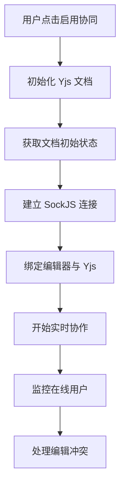

# 实时协作文档编辑器 - 技术文档

## 项目概述

实时协作文档编辑器是一个基于 Vue 3 + TypeScript + Yjs 的现代化富文本编辑系统，支持多用户实时协同编辑、版本控制、权限管理和知识库组织等功能。

### 核心特性

- **实时协同编辑**: 基于 Yjs CRDT 算法实现无冲突的多人协作
- **按需连接**: 用户主动启用协同功能，优化性能
- **富文本编辑**: 集成 @umoteam/editor 提供强大的编辑体验
- **版本控制**: 支持文档版本管理和历史回滚
- **权限管理**: 三级权限体系（read/write/admin）
- **知识库管理**: 文档分类组织和管理
- **评论系统**: 支持文档评论和回复功能
- **分享机制**: 支持文档分享码和邀请加入
- **SSR支持**: 支持服务端渲染，提升首屏加载性能

## 技术架构

### 前端技术栈

| 技术 | 版本 | 用途 |
|------|------|------|
| Vue 3 | ^3.5.13 | 渐进式前端框架 |
| TypeScript | ~5.8.3 | 类型支持和开发体验 |
| Yjs | ^13.6.18 | CRDT 协同编辑算法 |
| @hocuspocus/provider | ^3.1.3 | Yjs 协同提供者 |
| @umoteam/editor | ^6.1.1 | 富文本编辑器核心 |
| Element Plus | ^2.10.2 | UI 组件库 |
| Pinia | ^3.0.3 | 状态管理 |
| Vue Router | ^4.5.1 | 路由管理 |
| Axios | ^1.10.0 | HTTP 客户端 |
| SockJS Client | ^1.6.1 | WebSocket 连接 |
| Vite | ^6.3.5 | 构建工具 |
| Sass | ^1.89.2 | CSS 预处理器 |
| Express | ^4.18.2 | SSR 服务器 |
| Dayjs | ^1.11.13 | 日期处理 |
| Marked | ^9.1.2 | Markdown 解析 |

### 项目结构

```
co-write-frontend-main/
├── src/
│   ├── api/                    # API 接口层
│   │   ├── ai.ts              # AI 功能接口
│   │   ├── comment.ts         # 评论系统接口
│   │   ├── document.ts        # 文档管理接口
│   │   ├── knowledge.ts       # 知识库接口
│   │   ├── request.ts         # HTTP 请求配置
│   │   └── user.ts            # 用户管理接口
│   ├── components/             # 组件层
│   │   ├── common/            # 通用组件
│   │   │   ├── Header.vue     # 顶部导航
│   │   │   ├── Layout.vue     # 主布局
│   │   │   └── Sidebar.vue    # 侧边栏
│   │   ├── document/          # 文档组件
│   │   │   └── CreateDocumentDialog.vue
│   │   ├── editor/            # 编辑器组件
│   │   │   ├── AISummary.vue         # AI 摘要
│   │   │   ├── CollaborativeEditor.vue # 协同编辑器
│   │   │   ├── CommentItem.vue       # 评论项
│   │   │   ├── CommentSidebar.vue    # 评论侧边栏
│   │   │   ├── CommentSystem.vue     # 评论系统
│   │   │   ├── DocumentPermissions.vue # 权限管理
│   │   │   ├── Editor.vue            # 主编辑器
│   │   │   ├── VersionCompare.vue    # 版本对比
│   │   │   └── VersionHistory.vue    # 版本历史
│   │   └── knowledge/         # 知识库组件
│   │       ├── CreateKnowledgeDialog.vue
│   │       ├── DocumentList.vue
│   │       ├── EditKnowledgeDialog.vue
│   │       ├── KnowledgeList.vue
│   │       └── KnowledgeTree.vue
│   ├── stores/                # 状态管理
│   │   ├── document.ts        # 文档状态
│   │   ├── knowledge.ts       # 知识库状态
│   │   └── user.ts           # 用户状态
│   ├── types/                 # 类型定义
│   │   └── index.ts          # 统一类型导出
│   ├── views/                 # 页面视图
│   │   ├── 404.vue           # 404页面
│   │   ├── DocumentEditor.vue # 文档编辑页
│   │   ├── Home.vue          # 首页
│   │   ├── KnowledgeBase.vue # 知识库页
│   │   ├── Login.vue         # 登录页
│   │   ├── Register.vue      # 注册页
│   │   └── SharedEditor.vue  # 共享编辑页
│   ├── router/               # 路由配置
│   │   └── index.ts
│   ├── utils/                # 工具函数
│   │   └── index.ts
│   ├── styles/               # 样式文件
│   │   ├── common.scss       # 通用样式
│   │   └── variables.scss    # 样式变量
│   ├── entry-client.ts       # 客户端入口
│   ├── entry-server.ts       # 服务端入口
│   ├── main.ts              # 应用入口
│   ├── style.css            # 全局样式
│   └── vite-env.d.ts        # Vite 类型声明
├── public/                   # 静态资源
├── server-fixed.js          # SSR 服务器
├── package.json             # 项目配置
├── vite.config.ts          # Vite 配置
└── tsconfig.json          # TypeScript 配置
```

## 核心功能模块

### 1. 协同编辑系统

#### 架构设计
协同编辑基于 Yjs CRDT 算法实现，采用分层架构：

```typescript
// 协同编辑层次结构
DocumentEditor.vue
  ↓
CollaborativeEditor.vue (协同编辑包装器)
  ↓  
Editor.vue (富文本编辑器)
  ↓
CustomJsonProvider (自定义协同提供者)
  ↓
SockJS WebSocket (实时通信)
```

#### 核心组件

**CollaborativeEditor.vue**
- 管理协同编辑状态
- 处理在线用户显示
- 连接状态监控
- 协作历史记录

```typescript
interface Props {
  documentId: string
  userId: string
  username: string
  enabled?: boolean
}

interface Emits {
  (e: 'yjs-document-ready', ydoc: Y.Doc): void
  (e: 'connection-status-change', status: 'disconnected' | 'connecting' | 'connected'): void
  (e: 'online-users-change', users: string[]): void
}
```

**Editor.vue**
- 富文本编辑功能
- Yjs 文档绑定
- 自动保存机制
- 版本管理集成
- 动态加载 UmoEditor 避免 SSR 问题

#### 协同编辑流程



### 2. SSR 支持系统

#### SSR 配置
项目支持服务端渲染，提升首屏加载性能：

```typescript
// vite.config.ts - SSR配置
export default defineConfig({
  ssr: {
    noExternal: ['element-plus', '@popperjs/core'],
    external: ['@umoteam/editor'] // 避免SSR时的CSS导入问题
  }
})
```

#### 客户端入口处理
```typescript
// main.ts - 动态加载UmoEditor
if (typeof window !== 'undefined') {
  import('@umoteam/editor').then(({ useUmoEditor }) => {
    app.use(useUmoEditor);
  }).catch(error => {
    console.warn('UmoEditor加载失败:', error);
  });
}
```

### 3. 文档管理系统

#### 文档生命周期
1. **创建**: 指定知识库、标题、初始内容
2. **编辑**: 实时编辑、自动保存、版本记录
3. **协作**: 多人协同、权限控制、评论交流
4. **版本**: 创建版本节点、历史回滚
5. **分享**: 生成分享码、邀请协作者

#### 状态管理
使用 Pinia 管理文档状态：

```typescript
// document.ts store
export const useDocumentStore = defineStore('document', () => {
  const currentDocument = ref<GetDocumentResponse | null>(null)
  const knowledgeDocuments = ref<GetDocumentResponse[]>([])
  const userDocuments = ref<GetDocumentResponse[]>([])
  const recentDocuments = ref<GetRecentDocumentsResponse[]>([])
  const documentVersions = ref<DocumentVersion[]>([])
  
  // 核心方法
  const fetchDocument = async (docId: string) => { /* ... */ }
  const createNewDocument = async (data: CreateDocumentRequest) => { /* ... */ }
  const updateExistingDocument = async (id: string, data: UpdateDocumentRequest) => { /* ... */ }
  // ...
})
```

#### 共享文档管理
```typescript
// 获取用户加入的共享文档ID列表
const getSharedDocumentIds = (): string[] => {
  try {
    const stored = localStorage.getItem('userSharedDocuments')
    return stored ? JSON.parse(stored) : []
  } catch (error) {
    console.error('获取共享文档列表失败:', error)
    return []
  }
}
```

### 4. 权限管理系统

#### 权限级别
| 权限 | 说明 | 操作范围 |
|------|------|----------|
| read | 只读 | 查看文档内容 |
| write | 读写 | 编辑文档内容、参与协作 |
| admin | 管理 | 完整控制、权限管理、删除文档 |

#### 路由守卫权限检查
```typescript
// 路由守卫进行权限检查
router.beforeEach(async (to, from, next) => {
  const userStore = useUserStore()
  const token = localStorage.getItem('token')
  
  // 需要认证的路由
  if (to.meta.requiresAuth) {
    if (!token || !userStore.isLoggedIn) {
      next('/login')
      return
    }
  }
  next()
})
```

### 5. 知识库系统

#### 组织结构
```
知识库 (KnowledgeBase)
  ├── 文档A (Document)
  ├── 文档B (Document)
  └── 文档C (Document)
```

#### 路由结构
```typescript
// 知识库嵌套路由
{
  path: 'knowledge/:knowledgeId',
  name: 'KnowledgeBase',
  component: () => import('@/views/KnowledgeBase.vue'),
  children: [
    {
      path: 'document/:documentId',
      name: 'DocumentEditor',
      component: () => import('@/views/DocumentEditor.vue')
    }
  ]
}
```

## API 接口设计

### 基础配置
```typescript
// request.ts - HTTP 客户端配置
const request = axios.create({
  baseURL: import.meta.env.VITE_API_BASE_URL || 'http://localhost:8080',
  timeout: 10000,
  headers: {
    'Content-Type': 'application/json'
  }
})

// 请求拦截器 - 添加用户ID和Token
request.interceptors.request.use((config: InternalAxiosRequestConfig) => {
  // 客户端环境
  if (typeof window !== 'undefined') {
    const userId = localStorage.getItem('userId')
    const token = localStorage.getItem('token')
    
    if (userId) config.headers['X-User-Id'] = userId
    if (token) config.headers.Authorization = `Bearer ${token}`
  }
  // 服务端环境
  else {
    const ssrContext = (config as any).ssrContext
    if (ssrContext?.userId) config.headers['X-User-Id'] = ssrContext.userId
    if (ssrContext?.userToken) config.headers.Authorization = `Bearer ${ssrContext.userToken}`
  }
  
  return config
})
```

### 核心接口分类

#### 1. 用户认证接口
```typescript
// 登录
POST /auth/login
Request: { username: string, password: string }
Response: { token: string, user: User }

// 注册  
POST /auth/register
Request: { username: string, password: string }
Response: User

// 获取当前用户
GET /auth/me
Response: User
```

#### 2. 文档管理接口
```typescript
// 获取文档详情
GET /docs/{docId}
Response: GetDocumentResponse

// 创建文档
POST /docs
Request: CreateDocumentRequest
Response: CreateDocumentResponse

// 更新文档
PUT /docs/{docId}
Request: UpdateDocumentRequest
Response: UpdateDocumentResponse

// 删除文档
DELETE /docs/{docId}
Response: boolean

// 获取知识库文档列表
GET /kbs/{knowledgeId}/docs
Response: GetDocumentResponse[]

// 获取用户文档列表
GET /docs/user
Response: GetDocumentResponse[]

// 获取最近访问文档
GET /docs/recent
Response: GetRecentDocumentsResponse[]
```

#### 3. 协同编辑接口
```typescript
// SockJS 协同连接
SockJS /collab?docId={docId}&userId={userId}
Messages: JSON格式的协同数据

// 在线用户列表
GET /docs/{docId}/online-users
Response: string[] (用户ID数组)

// 在线用户数量
GET /docs/{docId}/online-count
Response: number
```

#### 4. 权限管理接口
```typescript
// 授权文档权限
POST /docs/{docId}/permissions/{userId}?permission={permission}
Response: string

// 撤销文档权限
DELETE /docs/{docId}/permissions/{userId}
Response: string

// 获取权限列表
GET /docs/{docId}/permissions
Response: GetDocumentPermissionsResponse[]
```

#### 5. 版本控制接口
```typescript
// 创建版本
POST /docs/{docId}/versions
Request: CreateVersionRequest
Response: DocumentVersion

// 获取版本列表
GET /docs/{docId}/versions
Response: DocumentVersion[]

// 恢复版本
POST /docs/{docId}/versions/{versionNumber}/restore
Response: string

// 删除版本
DELETE /docs/{docId}/versions/{versionNumber}
Response: string

// 版本对比
GET /docs/{docId}/versions/compare?version1={v1}&version2={v2}
Response: DocumentVersionCompareResponse
```

#### 6. 分享机制接口
```typescript
// 创建分享码
POST /docs/{docId}/shares
Request: { permission: 'read'|'write', expiresAt?: string, maxUsers?: number }
Response: ShareCode

// 通过分享码加入
POST /docs/join
Request: { shareCode: string }
Response: JoinDocumentResponse

// 验证分享码
GET /docs/shares/validate/{shareCode}
Response: { valid: boolean }
```

#### Vite 代理配置
```typescript
// vite.config.ts
export default defineConfig({
  server: {
    proxy: {
      '/auth': { target: 'http://localhost:8080', changeOrigin: true },
      '/docs': { target: 'http://localhost:8080', changeOrigin: true },
      '/kbs': { target: 'http://localhost:8080', changeOrigin: true },
      '/api': { target: 'http://localhost:8080', changeOrigin: true }
    }
  },
  // 修复SockJS兼容性
  define: {
    global: 'globalThis',
  }
})
```

### 项目启动

```bash
# 安装依赖
npm install

# 启动开发服务器
npm run dev

# 启动SSR开发服务器
npm run dev:ssr
```
